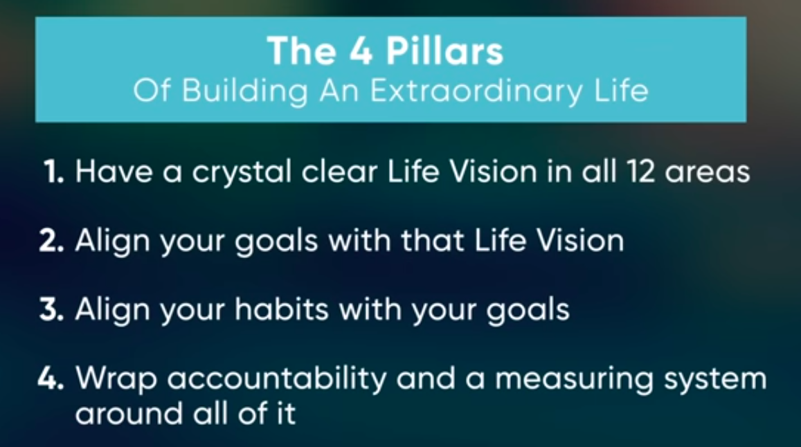

### Reasons People don't plan
  

### Importance Of Life Vision
Decision Making Framework (North Star)
   1. Many people don't want you to be your authentic self.
   2. Smartest people are trying to make you do what they want you to do.

# Four Pillars
## Create your life vision:
    - In the 12 areas of life, ask what do I want.

### 12 Categories of life:
  
#### 5 personal life categories
1. Health and fitness
2. Intellectual life
3. Emotional life
4. Character (Identity and meaning)
5. Spiritual Life

#### Relationship Categories
1. Love relationship
2. Parenting
3. Social Life
4. Financial Life
5. Career
6. Quality of life (the environment, home, office, travelling, experiences)
7. ##### Life Vision

#### Questions to ask to get clarity in each category.
1. What I believe to be true ? **(Identify Believes)**
2. What is my highest vision in that category ? **(Big Why)**
3. Why do I want this ? **Re-craft Believes**
4. What do I need to do to be get it ? **Strategize**

## A structured rhythm
of goal-setting and goal-accomplishment
- Every goal is aligned to the north star.

## Your 12 sacred choices
* Create 12 commitments that will take you towards your life goal.

## The accountability system
- Create accountability system.
- Measure the progress.

# Summary
  
